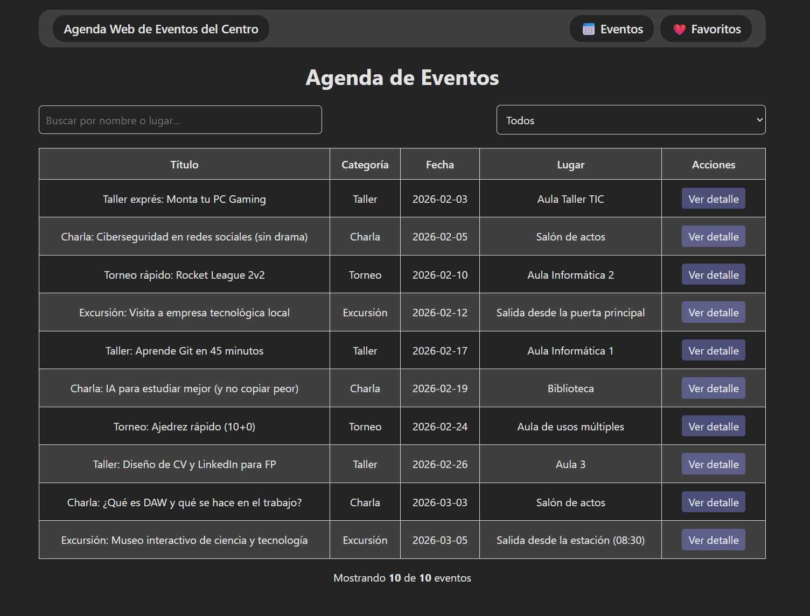
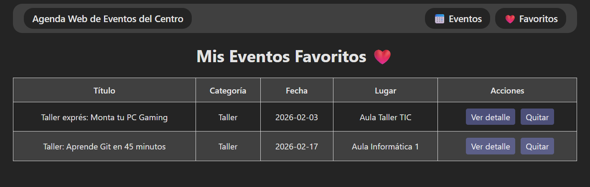

## Vista Principal

# Instrucciones

- Clonamos repositorio o descargar el zip entregable 'git clone'
- Instalar dependencias con 'pnpm install' / 'npm install'
- Iniciar servidor desarrollo con 'pnpm run dev' / 'npm run dev'

# Introducción

Crear app con Vite y React para consultar y organizar eventos del centro: charlas, torneos, talleres, etc
La app debe permitir ver eventos, buscar / filtrar, ver detalles y marcar favoritos.

# Entregables

- [✓] Proyecto React
- [✓] Readme.md con pasos para ejecutar
- [✓] Capturas

# Requisitos del proyecto

## 1. Proyecto desde cero

- [✓] Usar React y Vite para el proyectos
- [✓] Estructurar el código en componentes

## 2. DATOS:

- [✓] Eventos cargados desde eventos.json (Min. 8 eventos)

        id
        titulo
        categoria (Charla / Torneo / Taller / Excursión)
        fecha (YYYY-MM-DD)
        lugar
        descripción (2-3 lineas)

  Creamos carpeta src/datos y archivo eventos.json

## 3. Pantalla principal: Lista de eventos

- Debe tener:

  - [✓] Titulo: Agenda de eventos
  - [✓] Lista en tarjetas o tablas con: Titulo, categoría, fecha y lugar
  - [✓] Botón "Ver detalle" por evento
  - [✓] Buscador por texto (filtra por título o lugar)
  - [✓] Filtro por categoría (Select o botones)
  - [✓] Contador: "Mostrando X de Y eventos"

## 4. Pantalla detalle del evento:

- Debe tener:

  - [✓] Información del evento (Título , Categoría, Fecha, Lugar y Descripción)
  - [✓] Botón "Añadir a favoritos"
  - [✓] Si ya está en favoritos, mostar "En favoritos" y desactivar el botón

## 5. Pantalla favoritos:

- En la pantalla principal (o en una sección aparte) debe aparecer:

  - [✓] Lista de favoritos (títulos)
  - [✓] Botón “Quitar de favoritos”

## 6. Estados y errores:

- [✓] Mostrar “Cargando…” mientras se lee el JSON (simula carga con useEffect)
- [✓] Si el archivo no carga o está vacío, mostrar un mensaje de error

# Capturas

## Búsqueda y Filtrado

## Detalles del Evento

## Gestión de Favoritos

